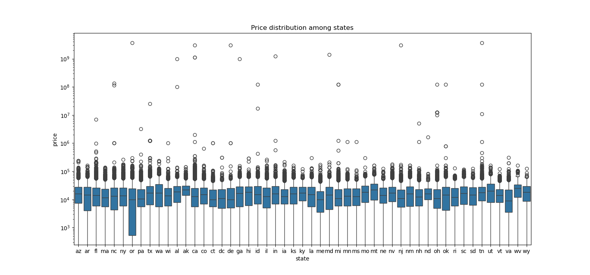
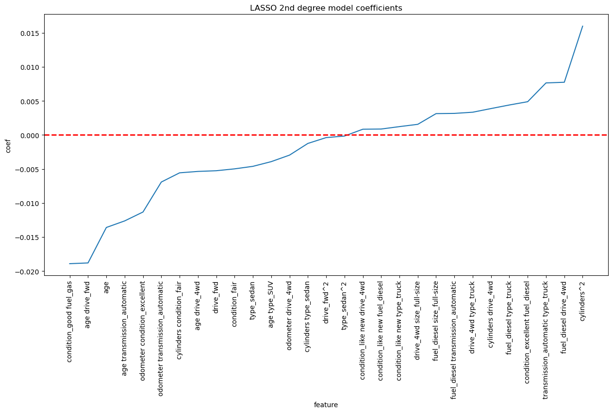
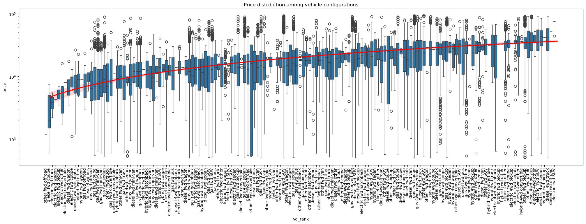

# Professional Certificate in Machine Learning and Artificial Intelligence: Module 11

# Analysis of Used cars data

Given [the dataset](data/vehicles.csv) we can conclude the following findings.
Full research can be found in [the notebook](prompt_II.ipynb) (possible [anaconda localhost](http://localhost:8889/lab/tree/pcmlai.m11/prompt_II.ipynb?))

Even though the analyzed dataset had predominantly California data, analysis shows that we can ignore state specifics and consider other features dictating the vehicle pricing:

While the data is incomplete on many vehicle features, having the manufacturer and model available is helpful in backfilling the missing data. Testing the backfilling opportunity confirmed 99.98% data availability:

The only non-repairable data gaps are in paint color (30%) and condition (40%)

From the target price point of view, there are many clear outliers listing the vehicle prices at billions, while the highest ever known price for a car in the world is \\$142 million. Similarly, there are records with \\$0, \\$1 and others lower than \\$100. The outlier cutoff is selected at 10% lowest values (anything below \\$500) and at P90 plus 1.5IQR (anything above \\$93K).

The resulting model is a LASSO model with 2nd degree polynomial features.

# Summary

Based on the analysis of the price data, it is clear that price is most influenced by the combination of fuel type, drive train and vehicle type. The full combination highlights diesel all-wheel-drive truck as the most preferential.
The following chart summarizes the distribution of vehicle configuration and their price ranges.

